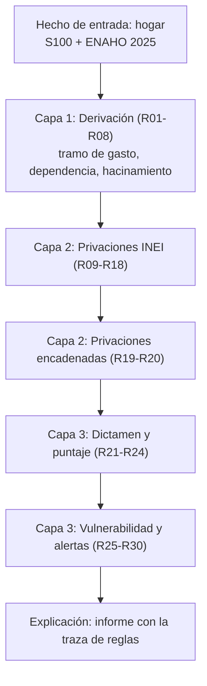

# 🧠 Sistema Experto para la Determinación Auditable de la Clasificación Socioeconómica (CSE)

Sistema experto basado en reglas, escrito en **CLIPS**, que evalúa la situación de pobreza de un hogar peruano y **explica cada resultado regla por regla**. Usa microdatos reales de la **ENAHO 2025 (INEI)** y los campos del **Formato S100 del SISFOH** (R.M. N.° 069-2024-MIDIS).


> Proyecto del curso **Sistemas Inteligentes (2026-2)** · Universidad Nacional Mayor de San Marcos (UNMSM), Facultad de Ingeniería de Sistemas e Informática.

---

## 🎯 ¿Qué problema resuelve?

Cuando un hogar postula a un programa social y es rechazado, la resolución suele mostrar solo el resultado, sin explicar por qué. Este sistema hace lo contrario: cada dictamen viene con la **traza de reglas** que lo produjo, para que sea transparente y apelable.

A partir de los datos de un hogar, el sistema emite:

| Salida | Valores posibles |
|---|---|
| **Dictamen monetario** | `pobreza-extrema` · `pobreza-no-extrema` · `no-pobre` |
| **Vulnerabilidad multidimensional** | `baja` · `media` · `alta` (con puntaje) |
| **Alerta de gestión** | `atencion-prioritaria` · `seguimiento-recomendado` · `revision-recomendada` · `ninguna` |

Alineado con el **ODS 1** (metas 1.3 y 1.4): sistemas de protección social apropiados e igualdad de derechos a los recursos económicos.

### 🤝 ¿Sirve para programas sociales?

Sí, como **primer filtro**. La clasificación socioeconómica del SISFOH es requisito de entrada de programas como Pensión 65, Juntos, Contigo, el SIS y las becas de Pronabec (Beca 18), pero cada programa pide además sus propios requisitos:

| Programa | Papel de la clasificación | Otros requisitos que este sistema **no** evalúa |
|---|---|---|
| Pensión 65 | Pobreza extrema | 65 años o más y no recibir otra pensión |
| Beca 18 | Pobre o pobre extremo (potencialmente elegible) | Criterios académicos |
| Juntos | Requisito principal | Hijos menores en el hogar y corresponsabilidades al día |

Con este sistema se podría: anticipar si un hogar caería en pobre o pobre extremo, priorizar casos con la vulnerabilidad y las alertas, explicar al hogar por qué recibió un resultado, y detectar posibles exclusiones (alerta `revision-recomendada`).

**Lo que no hace:** no decide por sí solo la elegibilidad a un programa, y no es la clasificación oficial. El SISFOH usa la ficha socioeconómica y cruza datos con SUNAT, RENIEC, Registros Públicos y otras entidades, información que este modelo no tiene.

---

## 🏗️ Arquitectura

La base de conocimiento tiene **30 reglas** en tres capas. La prioridad de disparo se controla con `salience`.



| Capa | Reglas | Salience | Función |
|---|---|---|---|
| 1. Derivación | R01–R08 | 100 | Tramo de gasto frente a las líneas de pobreza, tasa de dependencia, hacinamiento |
| 2. Privaciones directas | R09–R18 | 50 | Habitabilidad, piso de tierra, electricidad, agua, saneamiento, combustible, internet |
| 2. Privaciones encadenadas | R19–R20 | 45 | Menores y adultos mayores expuestos (se apoyan en privaciones ya inferidas) |
| 3. Dictamen | R21–R23 | 40 | Pobreza extrema, no extrema o no pobre |
| 3. Puntaje | R24 | 30 | Suma de los pesos de las privaciones |
| 3. Vulnerabilidad | R25–R27 | 20 | Baja (0–2), media (3–5), alta (6 o más) |
| 3. Alertas | R28–R30 | 10 | Combinan dictamen y vulnerabilidad |

**Sin conflictos ni vacíos por diseño:** R01–R03 dividen el gasto en tres tramos disjuntos, R04–R06 y R07–R08 hacen lo mismo con dependencia y hacinamiento, y R25–R27 con el puntaje. Cada hogar recibe exactamente un dictamen y un nivel de vulnerabilidad.

### Pesos de las privaciones (supuesto del modelo)

| Privación | Peso |
|---|---|
| Habitabilidad crítica (hacinamiento + piso de tierra), sin electricidad | 3 |
| Piso de tierra, hacinamiento, electricidad compartida, dependencia alta, sin agua de red, saneamiento inadecuado, combustible sólido, sin internet, menores expuestos, adultos mayores expuestos | 1 |

---

## 🚀 Cómo ejecutarlo

### 1. Instalar CLIPS

Descarga **CLIPS 6.4** desde su [página de SourceForge](https://sourceforge.net/projects/clipsrules/files/CLIPS/6.40/) (más información en [clipsrules.net](https://clipsrules.net/CLIPS64.html)). En Windows, instala el `.msi` y abre **CLIPS IDE**. Sirve cualquier versión 6.3 o superior.

### 2. Cargar el archivo

```clips
(clear)
(load "C:/ruta/a/tu/carpeta/cse_sistema_experto.clp")
```

> Usa barras normales `/` en la ruta. Al terminar debe mostrar `TRUE`, precedido de `%%%******************************!!!!!!!!!` (3 plantillas, 30 reglas y 9 funciones).

### 3. Correr los casos

```clips
(watch rules)      ; opcional: muestra cada regla que dispara
(caso-1)           ; también (caso-2) ... (caso-5)
(correr-todos)     ; ejecuta los 5 casos seguidos
```

Escribe un comando por vez y espera el `TRUE` antes del siguiente.

### 4. Evaluar tu propio hogar

```clips
(evaluar H9 "mi-hogar" rural 5 3 0 2 1 tierra sin-servicio red inadecuado solido si 210.16 222.11 342.91)
```

Orden de los argumentos:

`id clave area miembros menores15 mayores60 activos habitaciones piso luz agua saneamiento combustible internet gasto-pc linpe linea`

| Argumento | Valores |
|---|---|
| `area` | `urbano`, `rural` |
| `piso` | `tierra`, `otro` |
| `luz` | `exclusivo`, `compartido`, `sin-servicio` |
| `agua` | `red`, `otro` |
| `saneamiento` | `adecuado`, `inadecuado` |
| `combustible` | `limpio`, `solido` |
| `internet` | `si`, `no` |
| `gasto-pc`, `linpe`, `linea` | soles por persona al mes (gasto, línea de pobreza extrema y línea de pobreza total) |

---

## 🧪 Ejemplo de salida (caso 1)

```
FIRE    1 R01-tramo-bajo-lpe: f-1
FIRE    2 R04-dependencia-alta: f-1
FIRE    3 R07-hacinamiento-si: f-1
FIRE    4 R09-habitabilidad-critica: f-1,f-4
...
FIRE   13 R28-alerta-atencion-prioritaria: f-11,f-13

==============================================================
 INFORME AUDITABLE - HOGAR H1 (ENAHO 2025: 15280-29-11)
==============================================================
 Area: rural   Miembros: 5
 Gasto per capita mensual: S/ 210.16   (LPE: 222.11 | LPT: 342.91)
 DICTAMEN (monetario) ........: pobreza-extrema
 VULNERABILIDAD MULTIDIMENS. .: alta (puntaje 10)
 ALERTA ......................: atencion-prioritaria
```

### Los 5 casos incluidos (hogares reales de la ENAHO 2025)

| Caso | Hogar (`CONGLOME-VIVIENDA-HOGAR`) | Dictamen | Vulnerabilidad | Alerta |
|---|---|---|---|---|
| 1 | 15280-29-11 | pobreza-extrema | alta (10) | atencion-prioritaria |
| 2 | 20278-31-11 | pobreza-no-extrema | alta (6) | seguimiento-recomendado |
| 3 | 17800-78-11 | no-pobre | baja (0) | ninguna |
| 4 | 19413-537-11 | no-pobre | alta (6) | revision-recomendada |
| 5 | 19681-18-11 | pobreza-extrema | baja (1) | ninguna |

Los casos 4 y 5 son los más interesantes: en el 4, el gasto no detecta un hogar con habitabilidad crítica; en el 5, hay pobreza extrema por gasto pero casi sin privaciones de vivienda o servicios.

---

## 📊 Validación

El mismo conjunto de reglas se replicó en Python y se aplicó a **31 543 hogares** de la ENAHO 2025 (muestra sin factores de expansión):

- El dictamen coincide en el **100 %** con la clasificación oficial (`POBREZA` de la Sumaria). Es esperable, porque R01–R03 aplican la regla de decisión del INEI. El aporte propio es la lectura multidimensional.
- Vulnerabilidad: 63 % baja, 28 % media, 9 % alta. La vulnerabilidad alta es diez veces más frecuente en el área rural (22.4 %) que en la urbana (2.2 %).
- Alertas: 384 de atención prioritaria, 760 de seguimiento y 1 740 de revisión recomendada.

---

## 📚 Datos y fuentes

- **MIDIS.** R.M. N.° 069-2024-MIDIS, Anexo 1: Formato S100.
- **INEI, ENAHO 2025.** Módulos 100 (vivienda y hogar) y 200 (miembros) y Sumaria (gasto, líneas de pobreza y clasificación oficial). [Microdatos abiertos](https://proyectos.inei.gob.pe/microdatos/).
- **INEI.** Pobreza multidimensional, cuadros estadísticos 2016–2025 (definición de los indicadores de privación).
- **Naciones Unidas.** [ODS 1: Fin de la pobreza](https://sdgs.un.org/goals/goal1).

---

## ⚠️ Supuestos y limitaciones

- Es un **modelo académico**, no el algoritmo oficial de la CSE del SISFOH.
- Se usa el **gasto per cápita** (no el ingreso), como hace el INEI: `GASHOG2D / (12 × MIEPERHO)`, comparado con las líneas `LINPE` y `LINEA` de cada hogar.
- Menor = menos de 15 años; adulto mayor = 60 años o más; hacinamiento = más de 3 personas por habitación; dependencia baja ≤ 0.5, media hasta 1.0, alta > 1.0.
- Los indicadores 18, 19 y 29 del INEI se aproximan con variables de hogar (*proxies*); el Indicador 18 (agua) es menos exigente que el original.
- Los pesos y umbrales de vulnerabilidad son supuestos del modelo.
- No se modela el numeral 8 del S100 (pueblos indígenas de la Amazonía), porque requiere la lengua materna (módulo 300 de la ENAHO).
- El archivo `.clp` no usa tildes a propósito, para evitar problemas de codificación en la consola de CLIPS.

---

## 📁 Estructura del repositorio

```
.
├── cse_sistema_experto.clp   # Sistema experto completo (30 reglas + explicación + 5 casos)
└── README.md
```

---

## 👥 Autores

Curso **Sistemas Inteligentes** (2026-2), Sección 1, UNMSM. Docente: Delgadillo Ávila, Rosa Sumactika.

- Dioses Bellota, Angel
- Gálvez Molero, Jhade
- Perez Rojas, Edson
- Rumualdo Ibañez, Jefferson
- Romero Velasquez, Aldair
